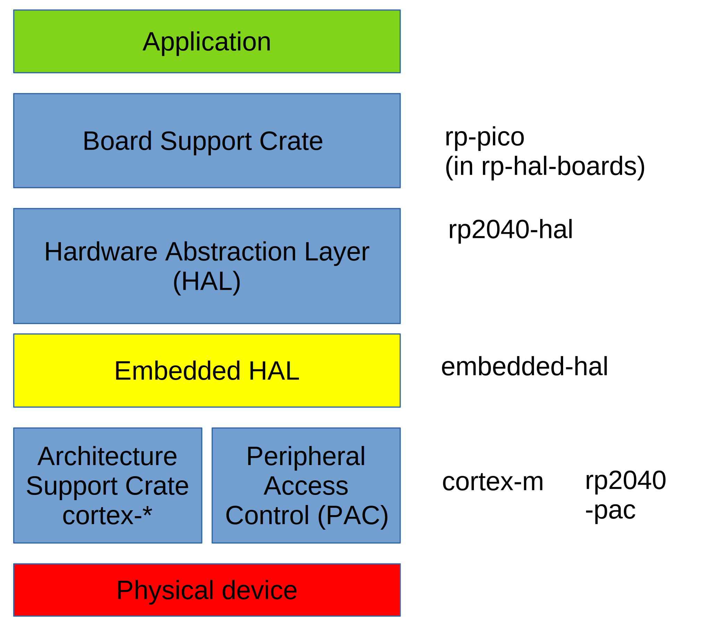

# Rust Embedded Architecture

## Important Links:

* rp-pico: (in Github)
  * **<https://crates.io/crates/rp-pico>** includes links to examples
  * ist in <https://github.com/rp-rs/rp-hal-boards>

* rp2040-hal:
  * **<https://github.com/rp-rs/rp-hal/tree/main/rp2040-hal/examples>** good starting point
  * <https://crates.io/crates/rp2040-hal> no links to examples
  * <https://docs.rs/rp2040-hal/latest/rp2040_hal/>
  * <https://github.com/rp-rs/rp-hal/tree/main/rp2040-hal>

* embedded-hal:
  * <https://github.com/rust-embedded/embedded-hal>
    - "Important info: `embedded-hal v1.0` is now released!"
  * <https://blog.rust-embedded.org/embedded-hal-v1/> Focus on drivers
    > We've removed traits that were found to not be usable for generic drivers (most notably timers).

    details: [migrating-from-0.2-to-1.0](https://github.com/rust-embedded/embedded-hal/blob/master/docs/migrating-from-0.2-to-1.0.md)
