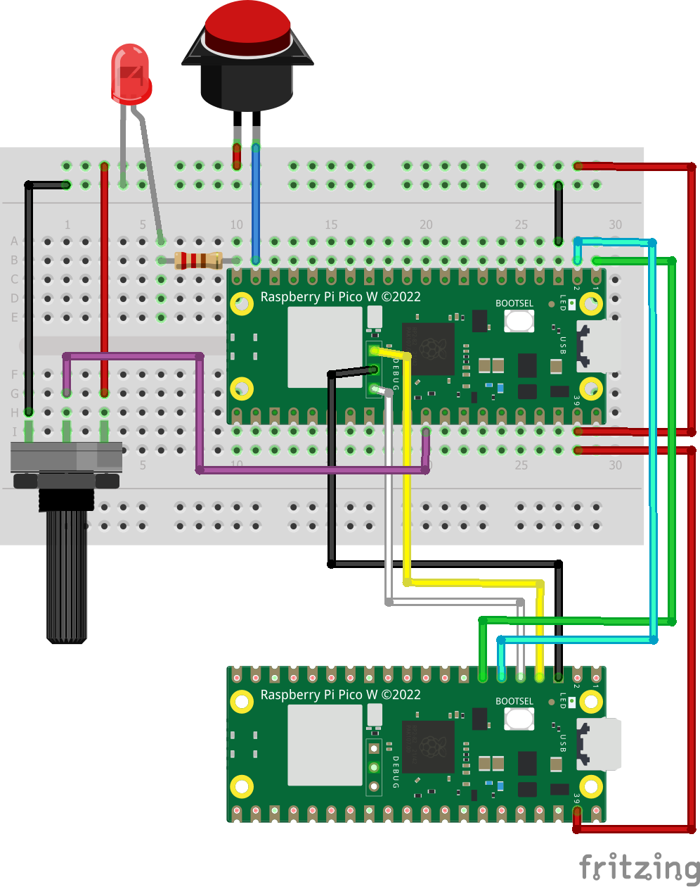
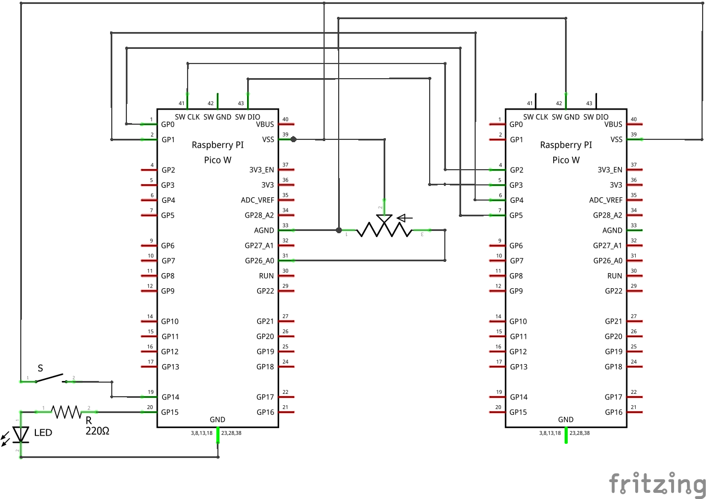
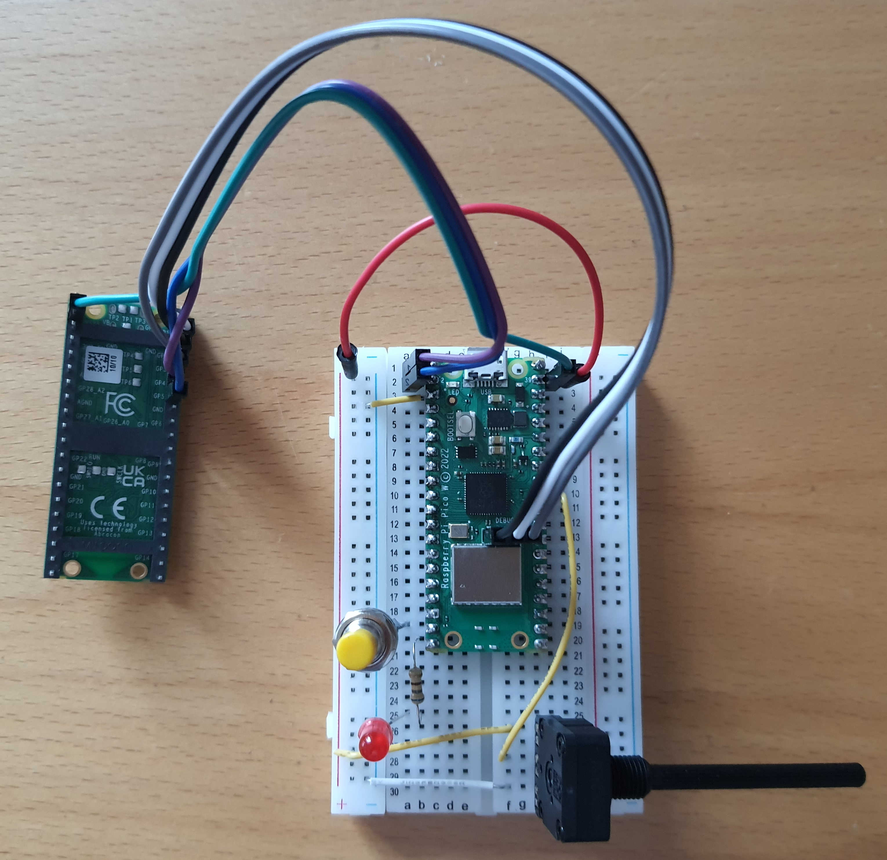

# Beschreibung des Hardware Aufbaus

## Stückliste

 * Pico W (als Debug Probe)
 * Pico W (als Target)
 * LED
 * Taster
 * Widerstand 670 Ohm
 * Potentiometer 470 KOhm
 * Female-Female-cable (zur Verbindung mit Debug Probe: 3 DebugPins)
 * Female-Male-cable (zur Verbindung mit Debug Probe: UART und Power)

## Steckbrettaufbau



**Belegte PINs von Target Pico:**

```
GP14 Taster
GP15 LED
GP26 / ADC0 Potentiometer
```

## Schaltplan



# Steckbrettverdrahtung

Für DebugPico sind die Pins entsprechend der Nummerierung auf dem Pico-Board angeordnet. 
Für die linke und rechte Seite des Steckbretts folgt die Pin-Nummerierung der jeweiligen Steckbrettnummerierung


## Steckbrett Linke Seite

| Quelle | Ziel         |
|-------:|--------------|
|      + | Rechts 2     |
|      1 | DebugPico 7  |
|      2 | DebugPico 6  |
|      3 | - (left)     |
|     19 | Button 1     |
|      + | Button 2     |
|     20 | Widerstand 1 |
|     25 | Widerstand 2 |
|     25 | LED Anode    |
|      - | LED Kathode  |

## Steckbrett Rechte Seite

| Quelle | Ziel            |
|-------:|-----------------|
|      2 | DebugPico 39    |
|      2 | + (links)       |
|     26 | + (links)       |
|     28 | 10              |
|     30 | - (links)       |
|     26 | Potentiometer 1 |
|     28 | Potentiometer 2 |
|     30 | Potentiometer 3 |


## DebugPins

Die Pins auf dem Debug Probe sind von links aufsteigend nummeriert (USB Stecker zeigt nach oben).

| Quelle | Ziel        |
|-------:|-------------|
|      1 | DebucPico 4 |
|      2 | DebucPico 3 |
|      3 | DebucPico 5 |

# Bild Steckbrettaufbau

